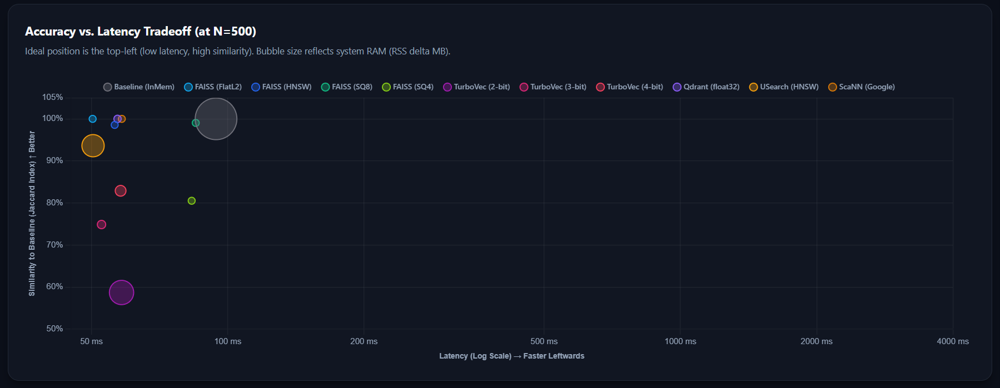

# Vector Search Benchmarks

A multi-scale, modular benchmarking suite for evaluating different vector search stores and algorithms.



## Overview

This project provides an orchestration framework to test and compare multiple vector databases and search libraries across different sample sizes (e.g., 500, 5k, 50k, 500k). It isolates runs in individual subprocesses and evaluates each store on:
- **Speed**: Indexing time, documents/second, average latency, and P95 latency.
- **Memory**: RSS usage delta, theoretical memory footprint, and compression ratios.
- **Quality**: Recall@k and Precision@k.
- **Agreement**: Overlap and Kendall rank correlation compared to an exact in-memory baseline.

---

## Codebase Architecture

The project has been refactored from a monolithic script into a clean, modular plug-and-play architecture:

```
├── core/
│   ├── config.py        # YAML config loader, BenchmarkConfig & StoreVariant dataclasses
│   ├── registry.py      # Decorator-based store registration
│   ├── store.py         # Abstract base class for vector stores
│   ├── metrics.py       # Pure functions for scoring and similarity evaluation
│   └── types.py         # Frozen value objects
├── reporting/
│   └── tee.py           # Dual console/file logging wrapper (with cp1252 fallback)
├── stores/
│   ├── baseline.py      # In-memory baseline store (LangChain InMemoryVectorStore)
│   ├── faiss_store.py   # FAISS store (FlatL2, FlatIP, HNSW, IVF+PQ, SQ)
│   ├── qdrant_store.py  # Qdrant in-memory store (float32 + quantization variants)
│   ├── scann_store.py   # ScaNN store (brute-force / tree-AH)
│   ├── turbovec_store.py# Quantized N-bit store (2/3/4-bit)
│   └── usearch_store.py # USearch HNSW store (cosine / L2 / IP)
├── utils/
│   ├── convert_json_to_markdown.py  # Convert aggregate JSON results to Markdown tables
│   └── merge_test_results.py        # Merge and diff results across multiple runs
├── data/
│   └── test_cases.json  # Global query dataset (JSON form)
├── benchmark_config.yaml  # YAML configuration file (stores, variants, paths, settings)
├── run_benchmark.py       # Main runner for a single sample size (process-isolated)
└── run_all.py             # Multi-scale orchestrator and comparison compiler
```

---

## Adding a New Vector Store

The suite uses a **Registry Pattern**. Adding a new vector store is as simple as creating a single Python file under `stores/`.

1. Create `stores/my_store.py`
2. Subclass `AbstractVectorStore`
3. Decorate your class with `@VectorStoreRegistry.register("my_store", "My Store (Display Name)")`
4. Implement the required abstract methods:

```python
from typing import List, Tuple, Any
from langchain_core.documents import Document
from core.store import AbstractVectorStore
from core.registry import VectorStoreRegistry

@VectorStoreRegistry.register("my_store", "My Store (Display Name)")
class MyStore(AbstractVectorStore):
    @classmethod
    def is_available(cls) -> bool:
        # Check dependencies
        return True

    @classmethod
    def build(cls, docs: List[Document], embeddings: Any, vecs: Any, texts: List[str], metadatas: List[dict], embed_dim: int, **kwargs) -> "MyStore":
        # Build index
        instance = cls()
        ...
        return instance

    def search(self, query: str, k: int) -> List[Tuple[Document, float]]:
        # Perform query search
        return ...

    @classmethod
    def theoretical_bytes(cls, embed_dim: int, num_docs: int, **kwargs) -> float:
        # Calculate theoretical size in MB
        return ...
```

5. Import your store module in `run_benchmark.py` and `run_all.py` (e.g., `import stores.my_store`).
6. Optionally add a `stores` entry in `benchmark_config.yaml` to configure variants and parameters.

---

## Setup

This project uses `uv` for dependency management. To set up the environment, run:

```bash
# Install dependencies
uv sync
```

### Optional dependencies

To use the detailed memory profiling feature with `memray` (Linux/macOS only):

```bash
uv sync --extra memray
```

---

## Running the Benchmarks

### Multi-scale orchestrator

Runs `run_benchmark.py` for each configured sample size, then compiles a cross-sample comparison report:

```bash
# Using a dataset path
uv run python run_all.py --dataset ./data/data.csv

# Using a YAML config file (recommended)
uv run python run_all.py --config benchmark_config.yaml
```

### Single sample size

```bash
uv run python run_benchmark.py --samples 500 --dataset ./data/data.csv

# Or with a config file
uv run python run_benchmark.py --config benchmark_config.yaml --samples 500
```

### CLI Options

| Flag | Applies to | Description |
|------|-----------|-------------|
| `--dataset PATH` | both | Path to the input CSV dataset. |
| `--config PATH` | both | Path to a YAML config file. YAML values take priority over CLI defaults. |
| `--test-cases PATH` | both | Path to the JSON test queries file (default: `./data/test_cases.json`). |
| `--output-dir PATH` | both | Output directory for results (default: `./results`). |
| `--samples N` | `run_benchmark.py` | Number of rows to load from the CSV. |
| `--store KEY` | `run_benchmark.py` | Run benchmark for a specific registered store only (e.g., `--store faiss`). |
| `--memray` | both | Enable detailed per-allocation memory profiling via `memray` (Linux/macOS only). |

---

## YAML Configuration

The `benchmark_config.yaml` file provides full control over every aspect of a benchmark run.  
When `--config` is specified, YAML values take priority over CLI defaults.

```yaml
# Paths
dataset: ./data/data.csv
test_cases: ./data/test_cases.json
output_dir: ./results

# Benchmark settings
sample_sizes: [500, 5000, 50000, 500000]   # for run_all.py
top_k: 10
timing_repeats: 5
embedding_model: sentence-transformers/all-MiniLM-L6-v2
# memray: false  # enable on Linux/macOS only

# Store variants
stores:
  faiss:
    enabled: true
    variants:
      - name: "FAISS (FlatL2)"
        params:
          index_type: flat_l2
      - name: "FAISS (IVF+PQ)"
        params:
          index_type: ivf_pq
          nlist: 100
          m: 8
          nbits: 8

  qdrant:
    enabled: true
    variants:
      - name: "Qdrant (float32)"
        params: {}
      - name: "Qdrant (Scalar INT8)"
        params:
          quantization: scalar
          scalar_type: int8

  usearch:
    enabled: true
    variants:
      - name: "USearch (Cosine)"
        params: { metric: cos }
      - name: "USearch (L2)"
        params: { metric: l2 }

  turbovec:
    enabled: true
    variants:
      - name: "TurboVec (3-bit)"
        params: { bit_width: 3 }

  scann:
    enabled: true      # Linux/macOS only
```

Each variant runs as its own row in the benchmark results and comparison tables.  
Setting `enabled: false` skips a store entirely.

---

## Pipeline Phases (`run_all.py`)

The orchestrator runs in three phases:

| Phase | Description |
|-------|-------------|
| **Phase 1 — Run benchmarks** | Spawns a subprocess for each sample size, producing `results_N.txt` and `summary_N.json`. |
| **Phase 2 — Load summaries** | Reads all `summary_N.json` files, with corruption/missing-file guards. |
| **Phase 3 — Build comparison** | Compiles a cross-sample, cross-store report with per-store scale tables, per-metric winner tables, an overall win-count tally, and a scale-effect latency trend summary. |

### Output files

```
results/
├── results_500.txt          ← human-readable per-run output
├── summary_500.json         ← machine-readable per-run metrics
├── results_5000.txt
├── summary_5000.json
│   …
├── aggregate_comparison.txt ← main cross-sample comparison report
└── aggregate_comparison.json← machine-readable aggregate data
```

### Programmatic API

`run_all.py` also exposes `run_benchmark_pipeline()` for use in scripts or notebooks:

```python
from run_all import run_benchmark_pipeline

run_benchmark_pipeline(
    sample_sizes=[500, 5000],
    dataset_path="./data/data.csv",
    output_dir="./results",
    config_path="benchmark_config.yaml",
    use_memray=False,
)
```

---

## Utility Scripts

| Script | Description |
|--------|-------------|
| `utils/convert_json_to_markdown.py` | Converts `aggregate_comparison.json` into formatted Markdown tables for reports or GitHub. |
| `utils/merge_test_results.py` | Merges and diffs results across multiple benchmark runs (e.g., comparing different model configs). |